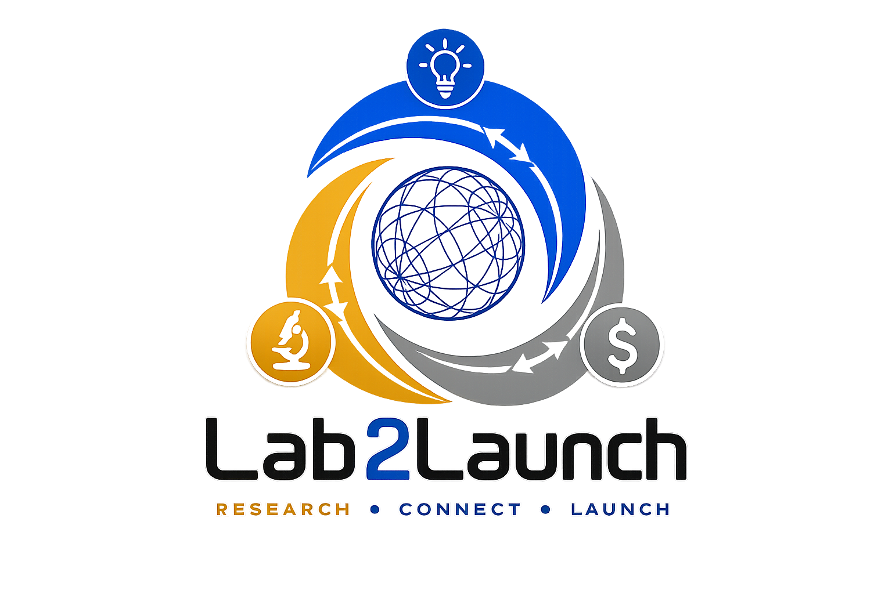
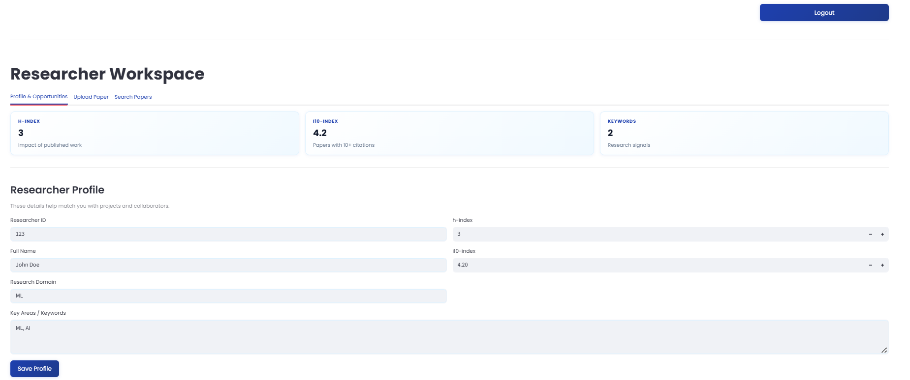
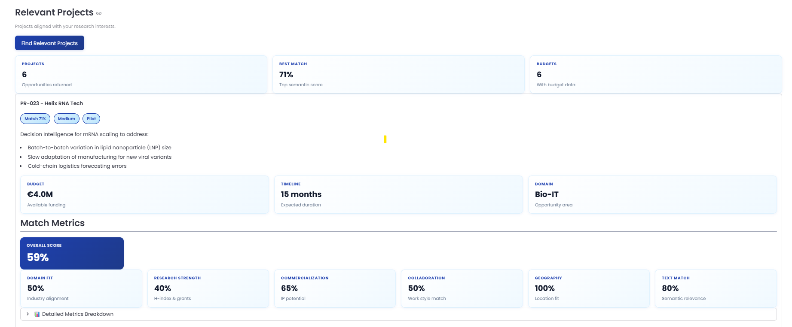
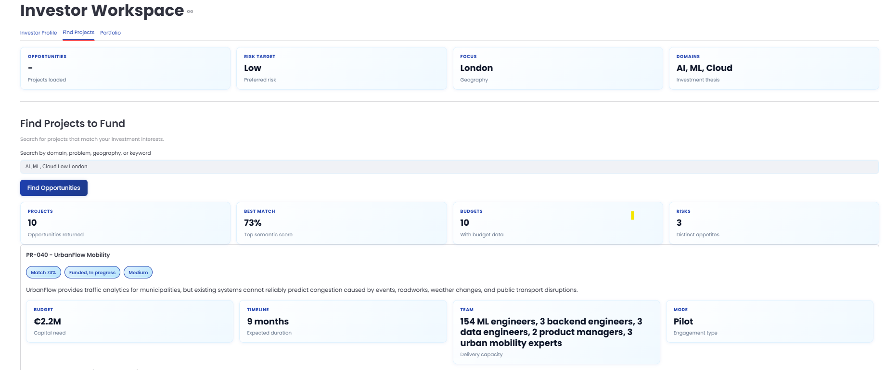

<p align="center">
  
  <br>
  <b>AI-powered matchmaking for researchers, businesses, and investors</b>
  <br>
  So great research does not stay stuck in PDFs.
</p>

---

## ✨ What is Lab2Launch?

Lab2Launch helps three groups find each other faster:

| User | Finds |
|---|---|
| 🧑‍🔬 **Researcher** | companies, projects, collaborators |
| 🏢 **Business** | researchers, papers, technical expertise |
| 💸 **Investor** | investable projects and companies |

---

## 🎯 Why it matters

Research and real-world problems often miss each other because they live in different databases, languages, and vocabularies.

**Lab2Launch bridges that gap.**

It turns papers, profiles, projects, and investor preferences into ranked, explainable matches.

---

## 🧠 How it works

```text
User query
   ↓
Role-based routing
   ↓
SQLite filtering
   ↓
ChromaDB semantic search
   ↓
Metric-based ranking
   ↓
LLM explanation
   ↓
Ranked recommendations
```

**Hybrid RAG = SQL filters + vector search + LLM explanation**

We do not send the full database to the LLM.  
We filter, retrieve, rank, and then explain only the best matches.

---

## 🖼️ Interface Preview

Add screenshots of your prototype here.

### Login / Role Selection


### Researcher Dashboard

<p align="center">
  
   
</p>

### Business Matching Dashboard

<p align="center">
  
</p>

### Investor Project Matching

<p align="center">
  
</p>


---

## 🏆 Core Features

- 🔍 **Semantic search** over papers, researchers, projects, and investors
- 🎯 **Role-aware recommendations**
- 📊 **Explainable match scores**
- 🧩 **Customizable user priorities**
- 🧠 **LLM-generated reasoning**
- 📄 **Paper upload and profile creation**
- 💼 **Investor-project and investor-company matching**

---

## 📊 Matching Signals

### Researcher → Company

`domain fit` • `commercial fit` • `company readiness` • `funding fit` • `collaboration fit` • `geography fit`

### Company → Researcher

`domain fit` • `research strength` • `commercial fit` • `collaboration fit` • `geography fit`

### Investor → Project

`domain fit` • `budget fit` • `risk fit` • `project maturity` • `company readiness` • `commercial potential`

---

## 🛠 Tech Stack

| Layer | Tools |
|---|---|
| Frontend | Streamlit |
| Backend | FastAPI, Python |
| Database | SQLite |
| Vector Search | ChromaDB |
| Embeddings | Sentence Transformers |
| AI Explanation | LLM layer |

---

## ▶️ Run Locally

### 1. Install dependencies

```bash
pip install -r requirements.txt
```

### 2. Initialize auth table

```bash
python backend/scripts/init_auth.py
```

### 3. Ingest data

```bash
python backend/scripts/ingest.py
```

### 4. Start backend

```bash
uvicorn main:app --reload
```

The backend runs at:

```text
http://127.0.0.1:8000
```

### 5. Start frontend

Open a second terminal and run:

```bash
streamlit run frontend/app.py
```

---

## 🗂 Useful Scripts

```bash
python backend/scripts/check_sqlite.py   # check database tables
python backend/scripts/check_chroma.py   # check vector collections
python backend/scripts/reset_users.py    # clear demo users
```

---

## 👥 Team Lab2Launch

| Name | Role | Location |
|---|---|---|
| Prajit Rajendran | AI Engineer | France |
| Preeti Verma | NLP Lead | Spain |
| Priyanshi Rastogi | Data Scientist | UK |
| Sonakshi Agarwal | Backend Developer | UK |
| Swastik Bhattacharya | Statistician | UK |

---

## 🔗 Links

- 🎥 Demo Video: _add YouTube link_
- 📩 Contact: **lab2launchofficial@gmail.com**

---

## 🌍 Vision

**Because the world cannot afford for good research to stay unread.**
